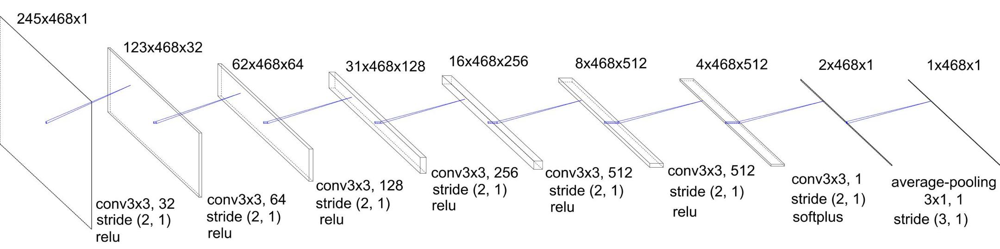
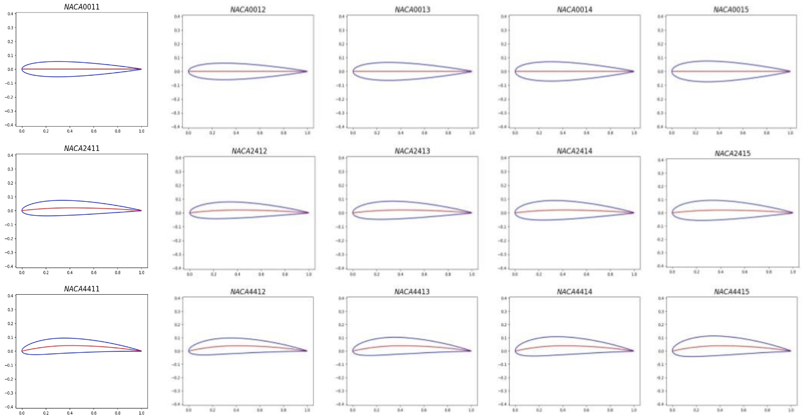

# Description
数値流体力学における抵抗算出手法のひとつ後流積分法の適用難易度を下げる手法の提案．
抵抗成分の可視化画像と表面積分法の抵抗値を教師データとして，畳み込みニューラルネットワークにより抵抗値分布を予測する．

# Dataset

データセットは抵抗値成分をグレースケールで可視化し，後流部分のみ切り出したものである．
計算対象をNACA4桁シリーズ00XX，24XX，44XX（XX=11， 12，13，14，15）として，Mach数0.7，迎角を0.5°刻みで0~5°で計算した．

